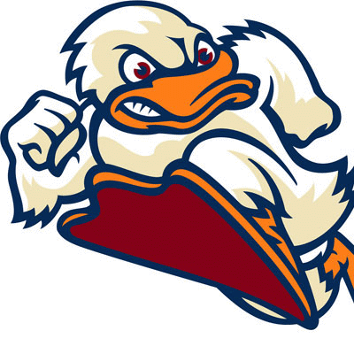
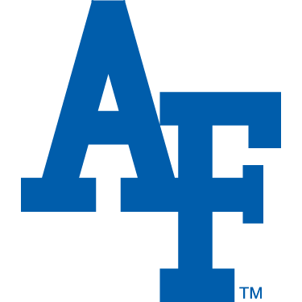
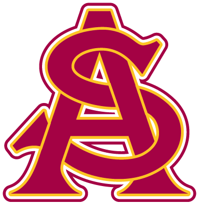

```{r include=FALSE, eval=FALSE}
wb      <- XLConnect::loadWorkbook('school_visit_list.xlsx')

data    <- XLConnect::readWorksheet(wb, 'sheet1')
oh.data <- XLConnect::readWorksheet(wb, 'sheet2')
```

```{r, eval=FALSE}
school <- mapply(FUN = function(x,y) { paste(c(x, y), collapse = ', ')}, 
                 x = data$School, 
                 y = data$Location )

oh.school <- mapply(FUN = function(x,y) { paste(c(x, y), collapse = ', ')}, 
                    x = oh.data$School, 
                    y = oh.data$Location )

locations <- ggmap::geocode(school)
oh.locations <- ggmap::geocode(oh.school)
```

```{r, eval=FALSE}
Schools <- data.frame(School    = locations[,1],
                      Longitude = locations[,2],
                      Latitude  = locations[,3],
                      Visit     = data$Visit,
                      Criteria  = data$Criteria,
                      Icon      = data$Icon,
                      Short     = data$Short,
                      stringsAsFactors = FALSE)

oh.Schools <- data.frame(School    = oh.locations[,1],
                         Longitude = oh.locations[,2],
                         Latitude  = oh.locations[,3],
                         Visit     = oh.data$Visit,
                         Criteria  = oh.data$Criteria,
                         Icon      = oh.data$Icon, 
                         stringsAsFactors = FALSE)

write.table(Schools,    file = 'qip-visits.txt')
write.table(oh.Schools, file = 'qip-visits-oh.txt')
```


```{r, eval=FALSE}
## Build the OH School Headings
for(i in 1:nrow(oh.schools)) {
  cat(paste(c("###  ", schools$Short,'\n\n'), collapse = ''))
}

## Build the Other Schools Headings
for(i in 1:nrow(schools)) {
  cat(paste(c("###  ",schools$Short[i],'\n\n\n'), collapse = ''))
}
```

### Overview of Vist Plan

```{r}
schools    <- read.table('qip-visits.txt', 
                         header = T, 
                         stringsAsFactors = F)
oh.schools <- read.table('qip-visits-oh.txt', 
                         header = T, 
                         stringsAsFactors = F)

library(leaflet)
library(flexdashboard)

shinyApp(options = list(height = '700px'),
  ui = fluidPage(mainPanel(leafletOutput('qip', height = '700px'), width = 12)),
  server = function(input, output, session) {
    
    output$qip <- renderLeaflet({
      
m <- leaflet()
m <- addTiles(m)
m <- addMarkers(m, 
                lng = schools$Lon, 
                lat = schools$Lat,
                popup = paste('<center><big><b>',
                              schools$School,
                              '</b></big></center><hr/><pre>',
                              '  Visit Date: ', schools$Visit, '<br/>',
                              'Criteria Met: ', schools$Criteria,'</pre>',
                              sep = ''),
                icon = icons(iconUrl = schools$Icon, iconHeight = 70, iconWidth = 70), 
                options = markerOptions(riseOnHover = TRUE, riseOffset = 500))
m <- addPopups(m,
               lng = schools$Lon, 
               lat = schools$Lat,
               options = popupOptions(maxWidth = 500))
m <- setView(map = m, lat = 40.580585, lng = -96.59181, zoom = 5)
m
})
})
```

###  Georgia Tech


###  MIT


###  Iowa


###  Wisconsin


###  Stevens


###  NYU Tech


###  NJIT


###  Montana State


###  New Mexico


###  Marshall


###  Embry-Riddle


###  Arizona


###  West Point


###  DAU


###  Louisiana Tech


###  Michigan State


###  NC State


###  Southern Cal


###  Virgina Tech


###  Rochester


###  Texas


###  Texas Tech


###  Cornell


###  Central Florida


###  Penn State


###  Geoge Washington


###  Washington


###  Air Force Academy


###  Naval Academy


###  Illinois - Champaign-Urbana


###  Daytona State


###  Stanford


###  Rose-Hulman


###  Arizona State
